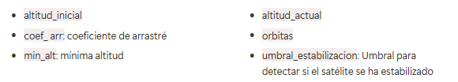
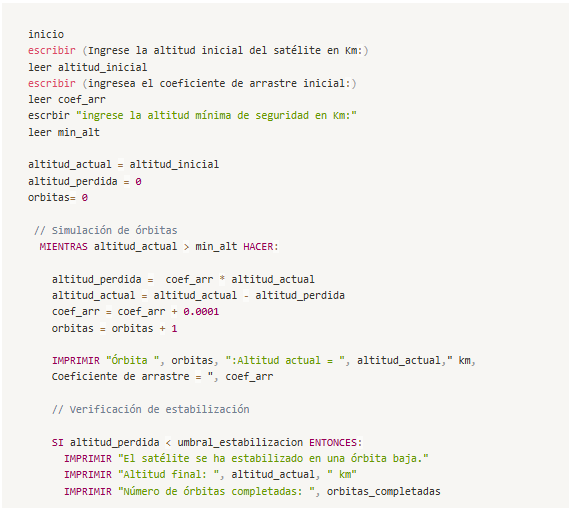

# ACTIVIDAD 1: HARDWARE Y SOFTWARE

 ## **HARDWARE**

### __Concepto:__ 
> La Real Academia Española lo define como «Conjunto de los componentes que integran la parte material de una computadora».

Es entonces el conjunto de los componentes que conforman la <mark>parte material</mark> (física) de una computadora. Está formado por los componentes eléctricos, electrónicos, electromecánicos y mecánicos. Tales como circuitos de cables y luz, placas, memorias, discos duros, dispositivos periféricos y cualquier otro material en estado físico que sea necesario para hacer que el equipo funcione.
Se refiere a la máquina en sí, al conjunto de cables, circuitos, etc. Representa la parte tangible del sistema informático, es decir, la parte que puede tocarse con las manos 
 
El término no solamente se aplica a los ordenadores, ya que es a menudo utilizado en otras áreas de la vida diaria y la tecnología como robots,​ teléfonos móviles, cámaras fotográficas, reproductores digitales o cualquier otro dispositivo electrónico. El hardware representa un concepto contrario al Software

Una forma de clasificar el hardware es en dos categorías: el **hardware principal**, que abarca el conjunto de componentes indispensables necesarios para otorgar la funcionalidad mínima, y por otro lado, **el hardware complementario**, que es el utilizado para realizar funciones específicas más allá de las básicas, no estrictamente necesarias para el funcionamiento del sistema informático.

Algunas de las partes principales son:

#### CPU
 <mark>(Unidad ​Central de Procesamiento)</mark> 
 
  
 
 Es un componente electrónico en forma de chip de silicio que está dentro de un ordenador, concretamente instalado sobre la placa base a través de un socket o zócalo. Es, en‍ esencia, ⁢el ‍»cerebro» de la máquina, encargado de recibir e interpretar datos y ejecutar las secuencias de instrucciones.

Entre sus funciones mas basicas estan recolectar información, decodificarla en partes menores y llevar a cabo instrucciones, que luego ejecuta.

Las unidades centrales de procesamiento no sólo están presentes en los ordenadores, sino que se incluyen en todo tipo de dispositivos que incorporan una cierta capacidad de proceso, algunos ejemplos de ellos son los controladores de procesos industriales, videoconsolas, televisores, automóviles, calculadoras, aviones, teléfonos móviles, electrodomésticos, juguetes y muchos más.

entre las partes mas importantes del CPU estan:
- Núcleo
- Unidad de control
- Unidad aritmetica logica
- unidad de coma flotante 
- memoria cache 
- bus
- tarjeta grafica

##### ¿Que es velocidad del reloj?
La velocidad de reloj es la velocidad a la que el procesador de un ordenador ejecuta las instrucciones como calculos y operaciones basicas.
se refiere a la cantidad de ciclos que se realizan por segundo en el procesador de un ordenador. Se mide en __gigahercios (GHz)__, y un GHz representa mil millones de ciclos por segundo. 

#### Memoria RAM:
<mark>(Random Access Memory)</mark> 

Es un tipo de memoria principal en dispositivos, Su función fundamental es almacenar temporalmente los datos de los programas y aplicaciones que estás utilizando en ese momento.

Se trata de un conjunto de chips que almacenan información, a la cual es posible acceder de una forma muy rápida, algo importante para que el procesador no tenga que esperar a que le lleguen los datos que necesita para seguir trabajando.

RAM significa Random Access Memory, literalmente memoria de acceso aleatorio. Este término tiene relación con la característica de presentar iguales tiempos de acceso a cualquiera de sus posiciones tanto para lectura como para escritura. Esta particularidad también se conoce como acceso directo, en contraposición al acceso secuencial de otros tipos de memoria.Una de las memorias RAM más usada en a actualidad es la DDR4 SDRAM.

#### HDD:
 <mark>(Hard Disk Drive o Disco Duro)</mark>

  es un dispositivo de almacenamiento que utiliza discos magnéticos para guardar datos de forma permanente.A diferencia de la RAM, los datos en un HDD no se pierden cuando apagas el dispositivo.
  se basa en un sistema de grabación magnética para almacenar archivos digitales. Un disco duro está formado por uno o más platos unidos por un eje que gira a gran velocidad dentro de una caja metálica sellada. Sobre cada una de las caras de cada plato se sitúa un cabezal de lectura y escritura que se mantiene en suspensión sobre una delgada lámina de aire generada por la rotación de los platos.
  
  El primer disco duro fue inventado por IBM en 1956, desde entonces ha multiplicado su capacidad y se han hecho más compactos.

#### Dispositivos de entrada y salida

Los dispositivos de entrada y salida o unidades de entrada/salida son los equipos físicos conectados a la computadora. Estos dispositivos permiten comunicar información entre el usuario y la computadora o manejar un soporte de información.
Son también llamados periféricos de computadora o periféricos de entrada y salida porque están separados de la unidad central de procesamiento.
algunos ejemplos: 

##### - Teclado y ratón:
Periféricos de entrada por excelencia, permiten el ingreso de datos del usuario a través de botones (teclas) y a través de movimientos y botones, respectivamente.

##### - Webcams 
También llamadas cámaras web, permiten el ingreso y transmisión de audio y video mediante el sistema.

##### - Micrófono
 Captura audio.
 
 ##### - Escáner o scanner
  dispositivo de entrada de datos que sirve para digitalizar documentos en formato físico, como fotografías y textos, para ser procesado en la computadora.
##### - Lector de código de barras
 se utiliza un lápiz óptico o un haz luminoso formado por un rayo láser capaz de realizar una imagen tridimensional que permite leer el código en cualquier posición.

## Software
 
>“El software es una gran combinación entre arte e ingeniería.” – Bill Gates
### Concepto:

designa a todo <mark>componente intangible</mark> (y no físico) que forma parte de dispositivos como computadoras, teléfonos móviles o tabletas y que permite su funcionamiento.
es un conjunto de programas, instrucciones y reglas informáticas que permiten ejecutar distintas tareas en una computadora.
Se considera que el software es el equipamiento lógico e intangible de un ordenador. En otras palabras, el concepto de software abarca a todas las aplicaciones informáticas, como los procesadores de textos, las planillas de cálculo, los editores de imágenes, los reproductores de audio y los videojuegos, entre otras muchas.
### Tipos de Software
- **Softwares de sistema o Sistema operativo:**
 
 Es un conjunto de programas informáticos que permite la administración eficaz de los recursos de una computadora. Estos programas comienzan a trabajar apenas se enciende el equipo, ya que gestionan el hardware desde los niveles más básicos y permiten además la interacción con el usuario.

 Los sistemas operativos no funcionan sólo en las computadoras. Por el contrario, este tipo de sistemas se encuentran en la mayoría de los dispositivos electrónicos que utilizan microprocesadores: el software de sistema posibilita que el aparato cumpla con sus funciones.

ejemplos:

-_Sistemas Operativos:_ Como Windows, macOS, Linux, Android, iOS.

-_Controladores de Dispositivos:_ Permiten que el sistema operativo interactúe con el hardware, como impresoras, teclados y monitores.

-_Firmware:_ Software integrado en el hardware que controla sus funciones básicas, como el BIOS.

-_Utilidades:_ Programas que realizan tareas de mantenimiento y optimización del sistema, como antivirus y desfragmentadores de disco
- **Softwares de programación:** 

Programas diseñados como herramientas que le permiten a un programador desarrollar programas informáticos. Se valen de técnicas y un lenguaje de programación específico. Por ejemplo

-_Editores de Código:_ Como Visual Studio Code.

-_Compiladores:_ Que traducen el código fuente a código máquina.
- **Softwares de aplicación:** 

Programas diseñados para realizar una o más tareas específicas a la vez, pueden ser automáticos o asistidos. ncluyen:

-_Procesadores de Texto_: Como Microsoft Word.

-_Hojas de Cálculo_: Como Microsoft Excel.

-_Software de Diseño Gráfico_: Como Adobe Photoshop.

- **Software Malicioso:**

 Diseñado con intenciones dañinas. Incluyen:

-_Virus:_ Programas que se replican y dañan archivos.

-_Spyware:_ Software que recopila información del usuario sin su consentimiento.

#### ¿Que es un driver?

es un pequeño software que conecta el sistema operativo directamente con los componentes del hardware de la PC.

El driver le da instrucciones al sistema operativo sobre cómo debe funcionar determinado hardware 

### Representación de la información en el ordenador

Aunque los datos pueden introducirse en el ordenador a través de un teclado semejante al de una máquina de escribir, utilizando los símbolos alfabéticos y numéricos convencionales, sus circuitos internos son incapaces de trabajar con este tipo de representación.

El ordenador es una maquina o sistema digital compuesto por infinidad de circuitos electrónicos 
que permiten detectar fácilmente si existe paso o no de corriente por ellos mismos.
Por este motivo, el sistema con el que se representa la información dentro del equipo informático es el 
sistema en base dos o **sistema binario**.

A cada carácter en lenguaje natural le corresponde una única combinación de impulsos eléctricos. Estos impulsos eléctricos son una combinación de tensiones altas (positivas) y bajas (negativas).Es por esto por lo que se dice que el lenguaje maquina es el código binario formado por únicamente dos dígitos **(0 y 1)**. 

Cada uno de estos dígitos representa un *bit* (binary digit). 

 **-Bit:** es la unidad más pequeña de representación de información en un ordenador, que se 
corresponde con un digito binario, 0 o 1.

### Interaccion entre el hardware y el software

Nos damos cuenta de que ambos son complementarios entre sí. El software necesita al hardware para poder ejecutar cualquier tipo de programa, y el hardware necesita al software para poder utilizar cualquiera de sus partes físicas. El software es lo que posibilita la comunicación entre el equipo y el usuario. Mientras el software aporta las operaciones, el hardware es el canal físico por el cual dichas funciones pueden realizarse.
 
 ## proceso de encendido de la computadora

durante el proceso de encendido del computador, hay un arranque con muchas cosas sucediendo en segundo plano

1. **encendido de todo el Hardware:** Cuando pulsas el botón de encendido, la computadora comienza a suministrar energía a todos los componentes que son: la placa base, CPU, discos duros o SSD, tarjetas gráficas y todos los demás periféricos. , el primer componente en activarse es el que suministra la energía, conocida como “Fuente de alimentación”
2. **La CPU carga el UEFI o BIOS**: 
3. **el BIOS o el UEFI prueba e inicializa todo el hardware:** El BIOS o UEFI cargan unos ajustes de configuración desde una memoria en la placa, conocida como CMOS. la CPU ejecuta el BIOS para probar e inicializar el hardware en el sistema, incluyendo la CPU. 
4. **Ahora debe arrancar el sistema operativo:** Cuando se termine de probar e inicializar el hardware, todo estará a manos del cargador de arranque del sistema operativo. El UEFI o BIOS buscan un dispositivo de arranque para arrancar el sistema operativo (normalmente el disco duro). 

## descubrimiento de esta actividad

En la actividad pude descubrir que Existen alrededor de 700 lenguajes de programación distintos. Entre esta lista, algunos de los lenguajes más populares son Javascript, Swift, Scala, Python, PHP, Go, Rust, Ruby y C#, con millones de usuarios que los utilizan tanto en sus carreras como en sus proyectos personales. Sin embargo, constantemente se crean nuevos lenguajes de programación. No era conciente de la cantidad de lenguajes que existian pues casi siempre se utilizan los mas famosos.

## fuentes:
 - https://www.tecnologia-informatica.com/que-son-drivers-controladores/
- https://academiairigoyen.com/wp-content/uploads/2017/04/TEMA-18-Informatica-basica.pdf
- https://concepto.de/software/#ixzz8gudc9jGh
- https://concepto.de/hardware-y-software/#ixzz8gqNUl1gB
- https://concepto.de/cpu/#ixzz8grVq1Riv

- https://techlib.net/techedu/velocidad-de-reloj/
- https://www.profesionalreview.com/procesador-cpu/
- https://definicion.de/software/#google_vignetteSoftwares 
- https://concepto.de/software/#ixzz8guea0nX0
- https://www.diferenciador.com/dispositivos-de-entrada-y-salida/
- https://blog.hubspot.es/sales/tipos-de-software
- https://tecnomagazine.net/tipos-de-software/
- https://www.significados.com/hardware/
- https://www.profesionalreview.com/hardware/